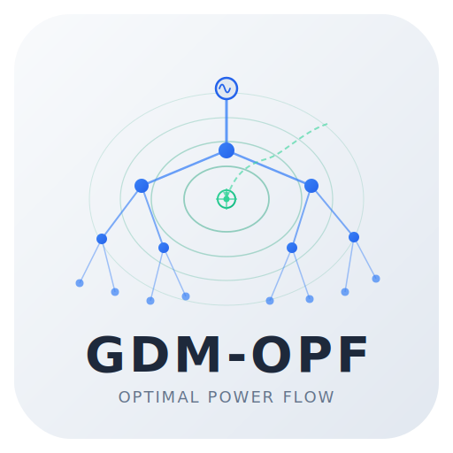

<p align="center">
  

# fgc-flow

[](https://github.com/FirstGridConsulting/fgc-flow/actions/workflows/ci.yml) • [](https://github.com/FirstGridConsulting/fgc-flow/actions/workflows/docs.yml) •  •  • [](https://github.com/FirstGridConsulting/fgc-flow/issues)

Utilities for OPF and power-flow style preprocessing on top of
`grid-data-models` distribution systems.

## Current features

- Build a phase-domain Y-bus matrix from a `DistributionSystem`
- Run an AC nodal optimization that uses Y-bus power equations
- Supports:
  - matrix impedance branches (`MatrixImpedanceBranch`)
  - switch-like matrix branches (`MatrixImpedanceSwitch`, fuse, recloser)
  - sequence impedance branches (`SequenceImpedanceBranch`)
- Optional line shunt charging from `c_matrix`
- Optional sparse matrix output when SciPy is installed

## Install

```bash
pip install -e .
```

If you also want sparse matrix return support:

```bash
pip install -e .[sparse]
```

If you want optimization support:

```bash
pip install -e '.[optimization]'
```

If you want to run the MCP server:

```bash
pip install -e '.[mcp,optimization]'
    fgc-flow-mcp-server
```

## Development checks

Install development dependencies and enable pre-commit hooks:

```bash
pip install -e '.[dev]'
pre-commit install
```

Run the same lint checks used in CI:

```bash
pre-commit run --all-files
```

Run the full test suite:

```bash
pytest -v --tb=short
```

Run MCP server tests locally (same scope as the dedicated CI MCP test job):

```bash
pip install -e '.[mcp,optimization,dev]'
pytest -v --tb=short tests/test_mcp_server.py
```

CI notes:

- `.github/workflows/ci.yml` runs matrix tests (`3.11`, `3.12`, `3.13`) in `test`
- `.github/workflows/ci.yml` runs MCP-specific tests in `mcp-test`

## Examples

An end-to-end examples folder is included at `examples/` with a downloaded demo
distribution model and runnable scripts for each optimization flavor:

- `examples/models/p5r.json`
- `examples/run_ac_opf_example.py`
- `examples/run_dc_opf_example.py`
- `examples/run_lindistflow_example.py`

Run from the repository root:

```bash
python examples/run_ac_opf_example.py
python examples/run_dc_opf_example.py
python examples/run_lindistflow_example.py
```

## Usage

```python
from gdm.distribution import DistributionSystem
from fgc_flow import calculate_ybus

system = DistributionSystem.from_json("path/to/system.json")
result = calculate_ybus(system, include_shunt=False)

Y = result.ybus
labels = result.index_to_label
```

`labels[k]` is a `(bus_name, phase)` tuple for row/column `k` of `Y`.

## Optimization usage

```python
from gdm.distribution import DistributionSystem
from fgc_flow import optimize_ac_power_flow

system = DistributionSystem.from_json("path/to/system.json")

# Specify net nodal injections in SI units: +generation, -load
p_spec_w = {("bus_5", "A"): -20_000.0, ("bus_5", "B"): -20_000.0, ("bus_5", "C"): -20_000.0}
q_spec_var = {("bus_5", "A"): -5_000.0, ("bus_5", "B"): -5_000.0, ("bus_5", "C"): -5_000.0}

result = optimize_ac_power_flow(
  system,
  p_spec_w=p_spec_w,
  q_spec_var=q_spec_var,
)

print(result.success, result.final_objective)
```

### Auto-build specs from components

If your model already contains `DistributionLoad` and `DistributionSolar` components,
you can build nodal injections automatically:

```python
from gdm.distribution import DistributionSystem
from fgc_flow import optimize_ac_power_flow_from_components

system = DistributionSystem.from_json("path/to/system.json")

result = optimize_ac_power_flow_from_components(
  system,
  include_loads=True,
  include_solar=True,
  include_capacitor=True,
  include_battery=False,
  include_regulator_targets=True,
  include_regulator_limits=True,
)

print(result.success, result.final_objective)
```

Notes:

- `include_capacitor=True` adds capacitor reactive injections into nodal `Q` specs.
- `include_regulator_targets=True` adds soft voltage-target constraints derived from regulator controllers.
- `include_regulator_limits=True` adds hard voltage magnitude bounds from regulator min/max limits.

## DC OPF module

`fgc-flow` also includes a separate DC OPF module:

```python
from gdm.distribution import DistributionSystem
from fgc_flow import solve_dc_opf_from_components

system = DistributionSystem.from_json("path/to/system.json")

result = solve_dc_opf_from_components(
  system,
  include_solar_generators=True,
  include_battery_generators=True,
  include_loads=True,
)

print(result.success, result.objective)
print(result.generator_dispatch_w)
```

## LinDistFlow module

`fgc-flow` includes a separate radial LinDistFlow approximation module:

```python
from gdm.distribution import DistributionSystem
from fgc_flow import solve_lindistflow

system = DistributionSystem.from_json("path/to/system.json")

result = solve_lindistflow(system)

print(result.success)
print(result.voltage_v)     # {(bus, phase): voltage_in_volts}
print(result.p_flow_w)      # {(branch_name, phase): active_flow_w}
```

## SQLite export module

You can export results from AC OPF, DC OPF, and LinDistFlow into one SQLite database:

```python
from fgc_flow import export_all_results_to_sqlite

run_ids = export_all_results_to_sqlite(
  "results.sqlite",
  ac_result=ac_result,
  dc_result=dc_result,
  lindistflow_result=lindistflow_result,
)

print(run_ids)
```

Or export each result type separately:

- `export_ac_opf_result_to_sqlite(...)`
- `export_dc_opf_result_to_sqlite(...)`
- `export_lindistflow_result_to_sqlite(...)`

### CLI export from JSON

Use the CLI to load saved result JSON files and export to SQLite in one command:

```bash
fgc-flow-export --db results.sqlite --ac-json ac_result.json --dc-json dc_result.json --lindistflow-json ldf_result.json
```

Generate starter JSON templates:

```bash
fgc-flow-export --write-templates ./templates
```

This creates:

- `templates/ac_result.template.json`
- `templates/dc_result.template.json`
- `templates/lindistflow_result.template.json`

Expected JSON fields:

- AC JSON:
  - `success`, `message`, `iterations`, `initial_objective`, `final_objective`
  - `index_to_label`: `[["bus", "phase"], ...]`
  - `voltage`: `[{"real": ..., "imag": ...}, ...]`
  - `power_injection`: `[{"real": ..., "imag": ...}, ...]`
- DC JSON:
  - `success`, `message`, `objective`, `iterations`, `slack_injection_w`
  - `generator_dispatch_w`: `{name: value}`
  - `theta_rad`: `{"bus|phase": value, ...}`
  - `nodal_balance_w`: `{"bus|phase": value, ...}`
- LinDistFlow JSON:
  - `success`, `message`, `source_bus`
  - `voltage_v`, `p_flow_w`, `q_flow_var`, `p_net_w`, `q_net_var`
  - All series use `{"name|phase": value, ...}` format.
